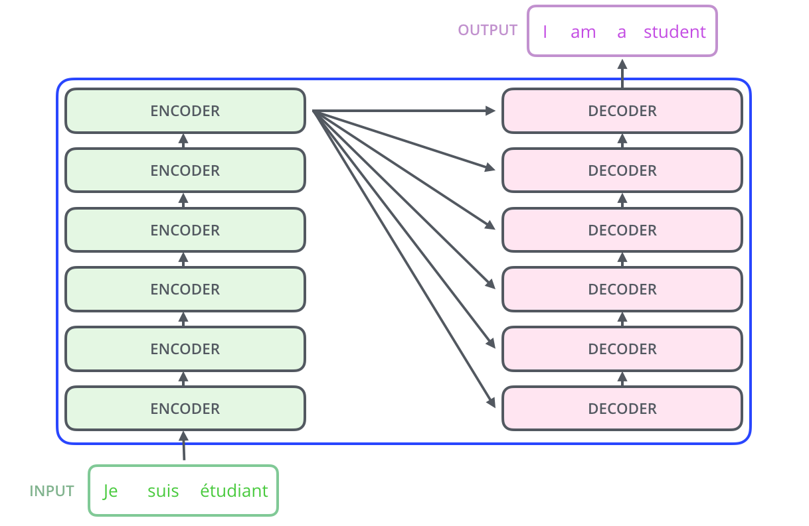

# kogpt2_ft

## GPT-2
### 트랜스포머
- 인코더 + 디코더
### GPT2
- 트랜스포머에서 디코더 스택만 사용한 언어 모델

- 첫번째 레이어에서 Masked Self Attention 사용
  - 셀프 어텐션을 계산할 때 해당 스텝의 오른쪽 단어들은 고려하지 않음

- Auto-Regressive
  - 셀프 어텐션을 계산할 때 해당 스텝의 오른쪽 단어들은 고려 X
    - 종속변수의 과거값만 이용
  - 다음 단어 예측엔 성능이 뛰어남, 해당 단어 이후에 있는 맥락 정보 이용은 힘들다

## GPT-2 구조
### Byte Pair Encoding
- 원래 정보를 압축하여 토큰화하는 기법
  - 사전 크기를 지나치게 늘리지 않으면서 데이터 길이를 압축
  - 토큰화 대상 문장 내 각 어절에서 어휘 집합에 있는 서브워드가 포함되어 있을 때 해당 서브워드를 어절에서 분리
  - 단어를 문자 단위로 쪼갬. 가장 빈도수가 높은 쌍을 하나로 통합하는 과정을 반복